# LAB04-AREP

### Francisco Javier Rojas Muñoz

## Desafió
* usted debe construir una aplicación con la arquitectura propuesta y desplegarla en AWS usando EC2 y Docker.
  * El servicio MongoDB es una instancia de MongoDB corriendo en un container de docker en una máquina virtual de EC2.
  
  * LogService es un servicio REST que recibe una cadena, la almacena en la base de datos y responde en un objeto JSON 
  con las 10 ultimas cadenas almacenadas en la base de datos y la fecha en que fueron almacenadas.
  
  * La aplicación web APP-LB-RoundRobin está compuesta por un cliente web y al menos un servicio REST. El cliente web tiene un campo y un botón y cada vez que el usuario envía un mensaje, este se lo envía al servicio REST y actualiza la pantalla con la información que este le regresa en formato JSON. El servicio REST recibe la cadena e implementa un algoritmo de balanceo de cargas de Round Robin, delegando el procesamiento del mensaje y el retorno de la respuesta a cada una de las tres instancias del servicio LogService.


## Solución

### Resumen
Este proyecto presenta la arquitectura de un cliente-servidor encargado del tratamiento de datos que en este caso son
los mensajes ingresados por los usuarios a su vez este cliente implementa el algoritmo RoundRobin para la distribución
de cargas para los logServices (3 para esta arquitectura) que es un controlador que procesa solicitudes extrayendo data
de la base de datos y entregándosela al cliente para su visualización. Por último la base de datos donde se almacena la
data de manera persistente (1 base de datos en MongoDB).

## Arquitectura
### cliente-servidor
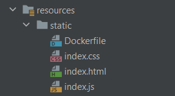

``` cd src/main/resources/static```

``` docker build --tag frontend .```

```docker run -d -p 80:80 frontend```


##### Docker file


### Log Service

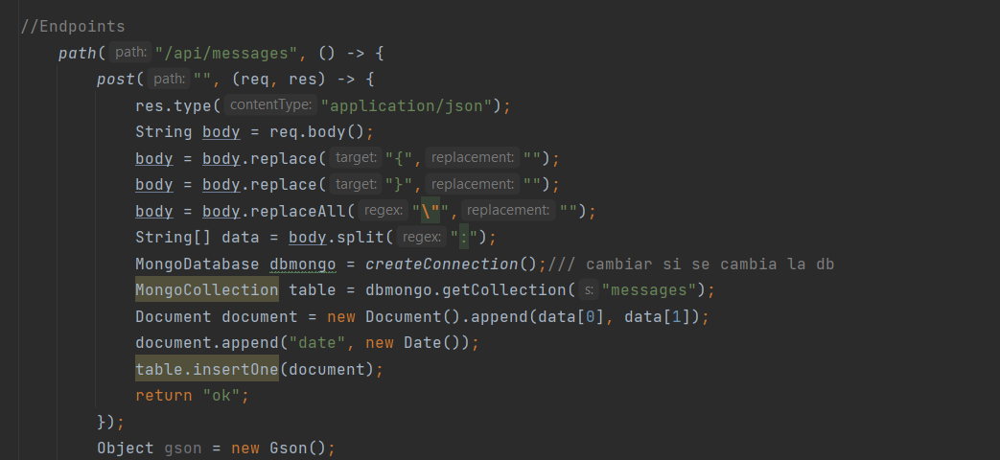
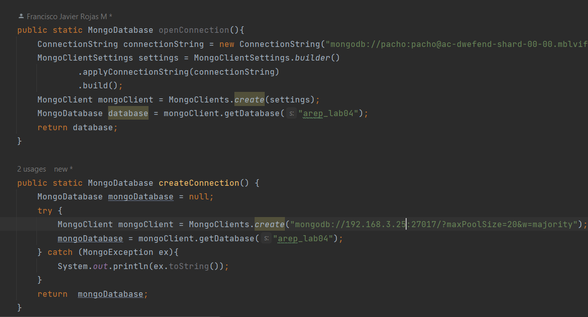
```docker build --tag logservice -f .\src\main\java\org\example\logservice\Dockerfile .```

```docker run -d -p 35001:35001 -e PORT=35001 logservice```

```docker run -d -p 35002:35002 -e PORT=35002 logservice```

```docker run -d -p 35003:35003 -e PORT=35003 logservice```


##### Docker file


### Round Robin
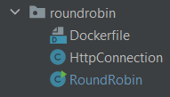

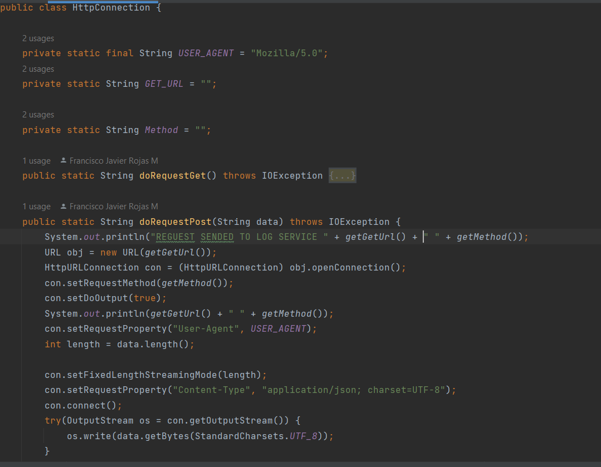
##### Docker file
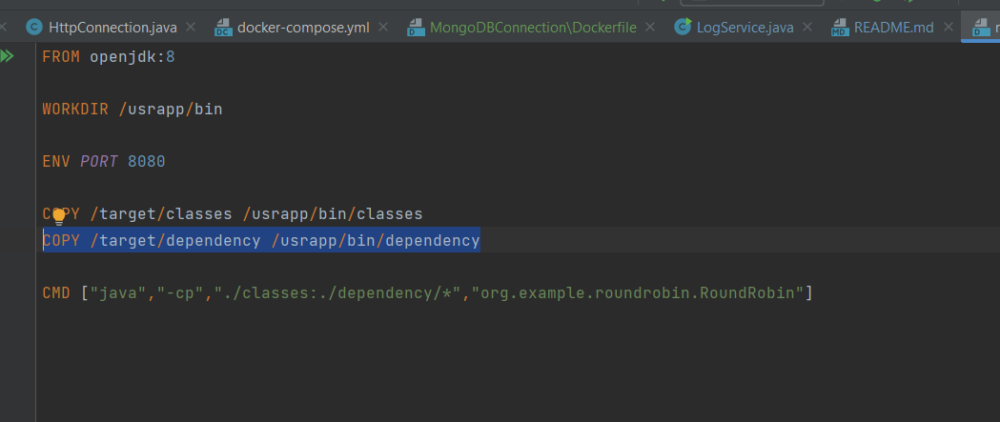


### Mongo DB
```docker run -d -p 27017:27017 mongo:3.6.1```

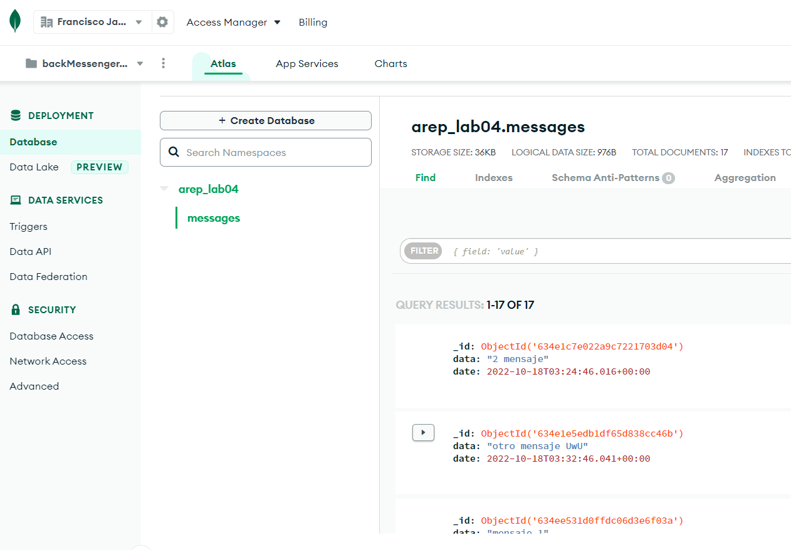


### PRUEBAS EN EL DESPLIEGUE AWS
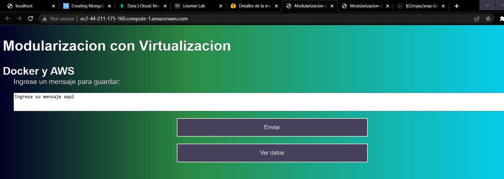

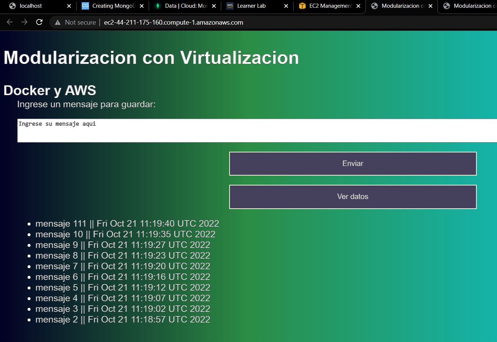

### Running steps
* poner la ip de la maquina local en las siguientes lineas


* Entrar a docker Hub y crear un repo
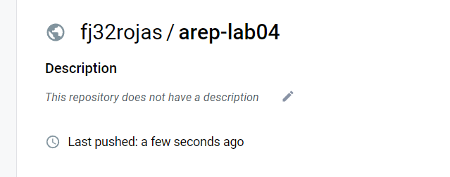
* crear referencia a las imagenes

```mvn package```
```docker login```

###### FRONTEND

```cd .\src\main\resources\static```

```docker build --tag frontend .```

```docker tag frontend fj32rojas/arep-lab04:frontend```

```docker push fj32rojas/arep-lab04:frontend ```

###### ROUND ROBIN

```docker build --tag round-robin -f .\src\main\java\org\example\roundrobin\Dockerfile .```

```docker tag round-robin fj32rojas/arep-lab04:round-robin```

```docker push fj32rojas/arep-lab04:round-robin  ```

###### LOG SERVICE

```docker build --tag logservice -f .\src\main\java\org\example\logservice\Dockerfile .```

```docker tag logservice fj32rojas/arep-lab04:logservice```

```docker push fj32rojas/arep-lab04:logservice```


* En su instancia de AWS en el directorio del archivo .pem conectese con
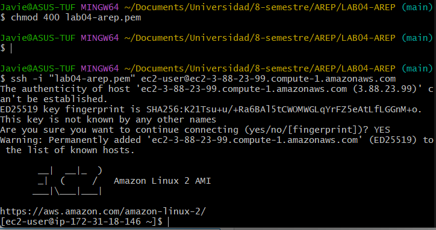

```sudo yum update -y```
```sudo yum install docker```
```sudo service docker start```

* NO olvide abrir los puertos

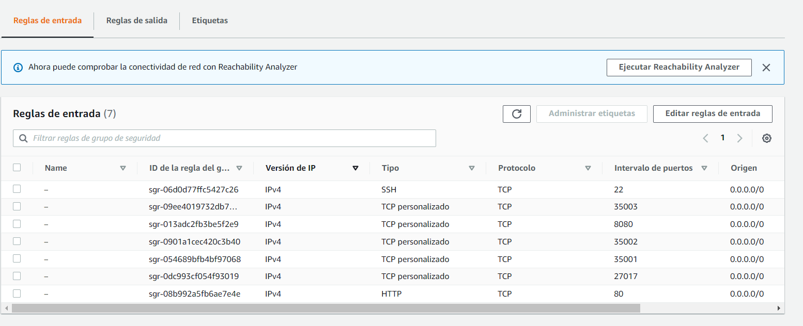

### Running scripts AWS

##### Frontend
``` 
sudo docker run -d -p 80:80 --name client-front fj32rojas/arep-lab04:frontend
```
##### Round Robin
``` 
sudo docker run -d -p 8080:8080 fj32rojas/arep-lab04:round-robin
```
##### Log Service
``` 
sudo docker run -d -p 35001:35001 -e PORT=35001 fj32rojas/arep-lab04:logservice
sudo docker run -d -p 35002:35002 -e PORT=35002 fj32rojas/arep-lab04:logservice
sudo docker run -d -p 35003:35003 -e PORT=35003 fj32rojas/arep-lab04:logservice
```
##### Mongo DB
```
docker run -d -p 27017:27017 mongo:3.6.1
```

### Running scripts LOCAL
##### Frontend
``` 
situarce en la carpeta static
cd \src\main\resources\static
docker build --tag frontend .
docker run -d -p 80:80 --name client-front frontend
```
##### Round Robin
``` 
docker build --tag round-robin -f .\src\main\java\org\example\roundrobin\Dockerfile .
docker run -d -p 8080:8080 round-robin
```
##### Log Service
``` 
docker build --tag logservice -f .\src\main\java\org\example\logservice\Dockerfile .
docker run -d -p 35001:35001 -e PORT=35001 logservice
docker run -d -p 35002:35002 -e PORT=35002 logservice
docker run -d -p 35003:35003 -e PORT=35003 logservice
```
##### Mongo DB
```
docker run -d -p 27017:27017 mongo:3.6.1
```
